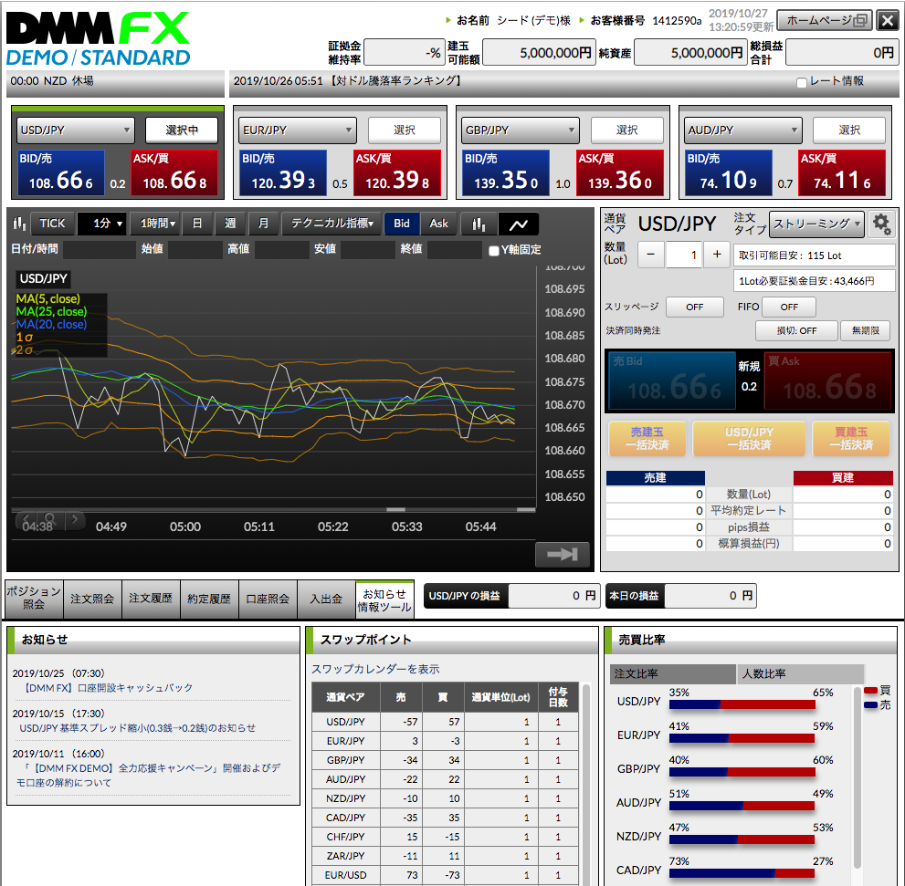

# デモ取引
FXで楽に大金を稼ぎたいなぁ。でも損をするのは怖いなぁ。
そんなときは、デモ取引だ。
[DMM FX デモ取引](https://fx.dmm.com/demo/)を使ってみよう。
初期仮想資金: 500万円で3ヵ月利用できるらしい。
> 2019年11月11日(月)より【DMM FX DEMO】全力応援キャンペーンを開催いたします。
これに伴い、11月9日(土)のシステムメンテナンスにすべてのデモ口座を解約(削除)させていただきます。

すぐに解約されてしまうが、まあ、なおさら気楽にできると割り切ってやってみよう。

## FXの取引可能時間
早速デモトレードをしようとしたら、あれ？
相場動いてないし、売り買いもできないぞ。
なんでだろう？システムメンテナンス中かな？
調べてみると、今日は日曜日なので、休みのようだ。
月曜日から取引を始めよう。

DMM FXの取引可能時間
- 土日以外の平日や祝日(元日を除く)は基本的に24時間お取引可能
- 具体的には、月曜AM7:00～土曜AM5:50が取引可能な時間