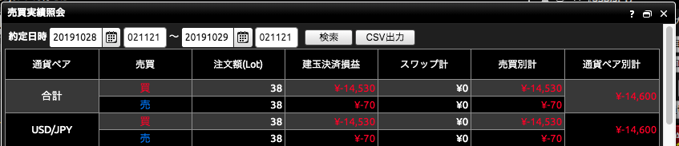
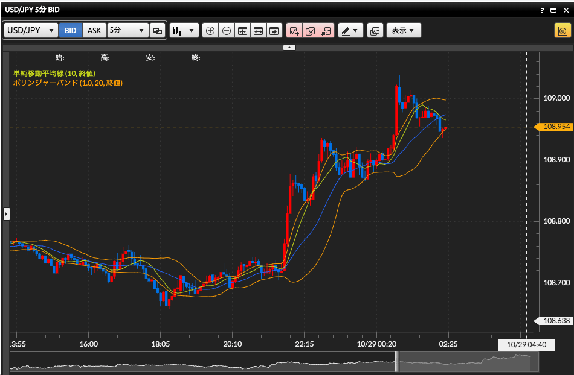
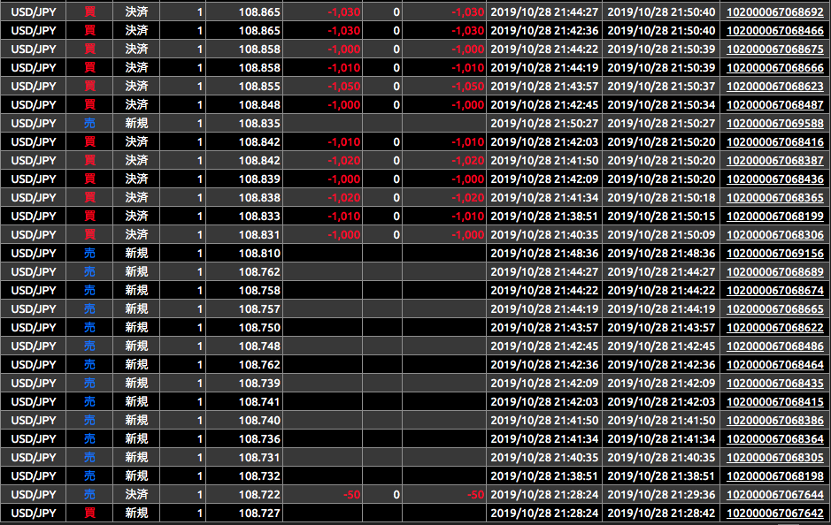

# 本日のトレード
ドル円で38Lotの取引をして、¥-14,600

## 振り返り
21時くらいからドル円のチャートを見始めた。
よくわからないが、テクニカル指標としては、
移動平均線とポリンジャーバンドを表示させていた。
21:30くらいから、突然ドル高になり、
ポリンジャーバンドのアッパーバンド2を超えるくらいになった。
データの散らばり具合から計算される標準偏差2σの範囲には、95%のデータが収まる
と言われているので、これはすぐに元に戻るだろう思った。
なので、すぐにドルの売りで入った。
しかし、その後も価格がどんどん上がった。
そのうち絶対下がるだろうと思っていたので、
どんどん売り玉を増やしていった。
それでも価格は上がっていく。
そして、どうやらデフォルトで損切りの設定(逆指値の買い注文)になっていたようで、
価格が上がりすぎた売り玉は損切り決済されてしまった。
まあ、そんな感じで大赤字になった。

## なぜ、ドル高になったのか
[ドル円は108.88円まで上昇、米大統領が中国との署名へ向けた作業進展に言及](https://zai.diamond.jp/list/fxnews/detail?id=328241)
どうやら、トランプ大統領の発言の影響らしいので、
ファンダメンタル的な動きだったようだ。

## ファンダメンタル的な動きにどう対応するか
ファンダメンタルは情報収集が大変なので、
それを判断できるだけの知識がない。
まずはテクニカル分析でトレードをしようと思う。
しかし、テクニカル分析通りにならないことは、確率的に発生するが、
連続で発生するとファンダメンタル的な動きが優勢だと疑う必要がある。
なので、予想が3連続で外れたら、いったんトレードを止めて情報収集をしよう。

## なぜ、大赤字になったのか？
FXは指値注文、逆指値注文があるので、損切り、利確をシステマチックに行える。
なのに、なぜ、こんなに大赤字になったのか。
理由は、ポリンジャーバンド指標だけを盲信して、
一度外れた予想のサンクコストが支払えず、損切りしたくなかったので、
後半は損切りしない設定で売り玉を増やしていったが、損失は増えるばかりだった。
また、デモトレードで500万円の仮想資金があるので、
倍プッシュ戦法ができたが、
実際に自分のお金でやるときは、10万円くらいから始めようと思っているので、
この戦略は全く使えない。
よって、倍プッシュ戦法はやめる。
ポジションは1Lotのみで売り玉か、買い玉のどちらかしか一度に保持しない。

# 明日の戦略
- 注文方法は、IFOを使い、新規注文した時点で、利確と損切りが自動で行われるようにしておく。
- トレードは常に1Lotで行う
- 1日のトレードは10回までとし、勝率50%以上を目指す。
- 3連敗したら、トレードを中止して、戦略を立て直す。 
