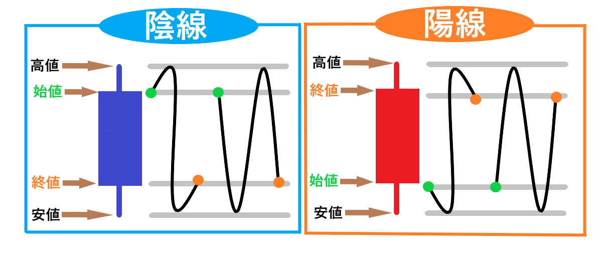

# 本日のトレード（ドル円で1Lot単位）
- デモトレード5日目
- 2勝1敗
- 日次損益: +200円

# 勝因
- よくわからない相場のときや、トレンドのないときには、トレードしなかった。

# やったこと
- ポリンジャーバンドへの値の戻りを期待しつつ、外れ値でIFO注文

# 所感
やっぱり全然値動きの根拠がわからない。
まあ、毎日コツコツトレードして行こう。
日次のトレードで勝率5割を超えて、
勝率5割を超えた日が月の5割以上なら、
FXで勝ち組だと言えるだろう。
実績が出るまで、PDCAを回すしかない。

# お勉強
## ローソク足
- ローソク足(Candle Chart)とは日本で考案され、ローソクに似ていることから名付けられた。
- ローソク足は、実体とヒゲでできている。
- 1日単位で区切る「日足」の場合、ローソク足が以下のような意味を持つ。
    - 高値: 1日で取引されたもっとも高い価格。上ヒゲの先。
    - 安値: 1日で取引されたもっとも安い価格。下ヒゲの先。
    - 陽線: 始値よりも終値が高いローソク足。
    DMM FXのチャートでは、陽線は赤色で表示されている。
    - 陰線: 始値よりも終値が安いローソク足
    - 始値: 1日の最初に値が付いた価格。陽線では、ローソク足の実体の下側。
    - 終値: 1日の最後に値が付いた価格。陽線では、ローソク足の実体の上側。

